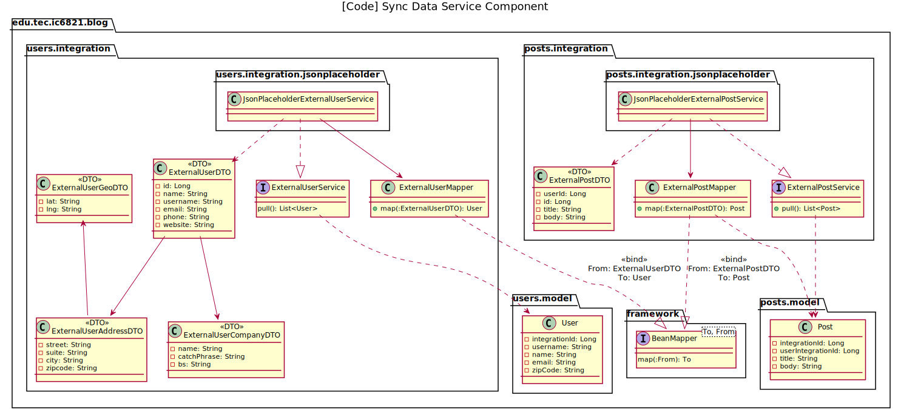

# Tarea corta #7 #

Curso IC-6821 Diseño de software  
Profesor Diego Munguía Molina

## Objetivos ##

* Implementar un diseño arquitectónico para integrar componentes locales con un sistema externo

## Guía de trabajo ##

Iniciamos el desarrollo de un sistema de información. Construiremos partes de una aplicación de blogging.

La arquitectura del sistema se documenta en [ARCHITECTURE.md](./ARCHITECTURE.md) utilizando el modelo C4.

El sistema se alimentará de datos y contenido producido por sus propios usuarios, pero también importará datos de 
usuarios y artículos desde un sistema legado llamado JsonPlaceholder https://jsonplaceholder.typicode.com/.

### Tarea 1 ###

Implementar integración con JsonPlaceholder para importar los datos sobre artículos desde el sistema externo. 

Esta integración está modelada a través de un servicio llamado `ExternalPostService` 



JsonPlaceholder ofrece un API que permite acceder a sus datos a través del protocolo REST. Los artículos se encuentran
disponibles a través del recurso `GET https://jsonplaceholder.typicode.com/posts`. Un *request* a este recurso retorna 
una lista de objetos en formato JSON con la siguiente estructura:

```json
{
    "userId": 1,
    "id": 1,
    "title": "sunt aut facere repellat provident occaecati excepturi optio reprehenderit",
    "body": "quia et suscipit\nsuscipit recusandae consequuntur expedita et cum\nreprehenderit molestiae ut ut quas totam\nnostrum rerum est autem sunt rem eveniet architecto"
}
```

* `userId` : el identificador en JsonPlaceholder del usuario que creo que el artículo.
* `id` : el identificador en JsonPlaceholder del artículo.
* `title` : el título del artículo.
* `body` : el contenido del artículo.

La interfaz `ExternalPostService` y su implementación `JsonPlaceholderExternalPostService` presentan un método público 
`pull(): List<Post>` que envía el *request* a JsonPlaceholder para traer los datos y transformarlos a una lista de 
objetos de modelo de tipo `Post`.

Los *request* de HTTP se harán a través del componente de Spring llamado `RestTemplate`. La estructura de JSON se 
modelará en Java con la clase `ExternalPostDTO`. Esta clase implementa el patrón Data Transfer Object (DTO), que se \
utiliza para modelar datos que se transfieren entre sistemas.

La clase `ExternalPostMapper` tiene la responsabilidad de transformar instancias de `ExternalPostDTO` en instancias de 
`Post`. 

En nuestra entidad `Post` queremos mantener registro de los identificadores que vienen desde el sistema externo, 
pero también queremos diferenciarlos de los identificadores que manejaremos internamente a nivel de la base de datos que
estaremos construyendo más adelante. Por esta razón, en la clase `Post` mapeamos el `id` del DTO a una propiedad 
llamada `integrationId`, para indicar que es el identificador asociado a la integración con el sistema externo. De igual
forma `userId` en el DTO se mapea a `userIntegrationId` en `Post`.

Debe implementar las clases:

* `JsonPlaceholderExternalPostService`
* `ExternalPostDTO`
* `ExternalPostMapper`

Debe trabajar en el paquete `edu.tec.ic6821.blog.posts.integration`, según se muestra en el diagrama de diseño.

El repositorio ya contiene una implementación semejante para importar usuarios desde JsonPlaceholder en 
`edu.tec.ic6821.blog.users.integration`. Puede utilizar ese código como referencia.

## Aspectos operativos ##

- No modificar ningún archivo de código ya existente en el repositorio.
- No modificar ninguna prueba automatizada.
- No modificar ningún chequeo de estilo. 
- No utilizar spanglish.
- Escribir código limpio.
- Las pruebas de código verifican todos los requerimientos funcionales.
- Como entrega se considera el último `push` de código al repositorio antes de la revisión del trabajo.
- Puede encontrar información sobre cómo corregir problemas identificados por los chequeos de estilo en el siguiente 
  enlace: https://checkstyle.sourceforge.io/checks.html 

## Rúbrica ##

#### Total 10 pts #### 

#### Entrega (2 pts) ####
- (2 pts) El historial del repositorio contiene commits significativos de la persona estudiante.
- (0 pts) El historial del repositorio no contiene commits significativos de la persona estudiante. Si no hay commits 
  significativos, el resto de criterios no serán aplicados.

#### Chequeo de estilo (2 pts) ####
- (2 pts) El código en el repositorio pasa todos los chequeos de estilo.
- (0 pts) El código en el repositorio no pasa todos los chequeos de estilo.

#### Chequeo de diseño (3 pts) ####
- (3 pts) El código en el repositorio pasa todos los chequeos de diseño.
- (1 pts) El código en el repositorio pasa la mayoría de los chequeos de diseño.
- (0 pts) El código en el repositorio no pasa los chequeos de diseño.

#### Pruebas de código (3 pts)
- (3 pts) El código en el repositorio pasa todas las pruebas de código.
- (1 pts) El código en el repositorio pasa la mayoría de las pruebas de código.
- (0 pts) El código en el repositorio no pasa las pruebas de código.

